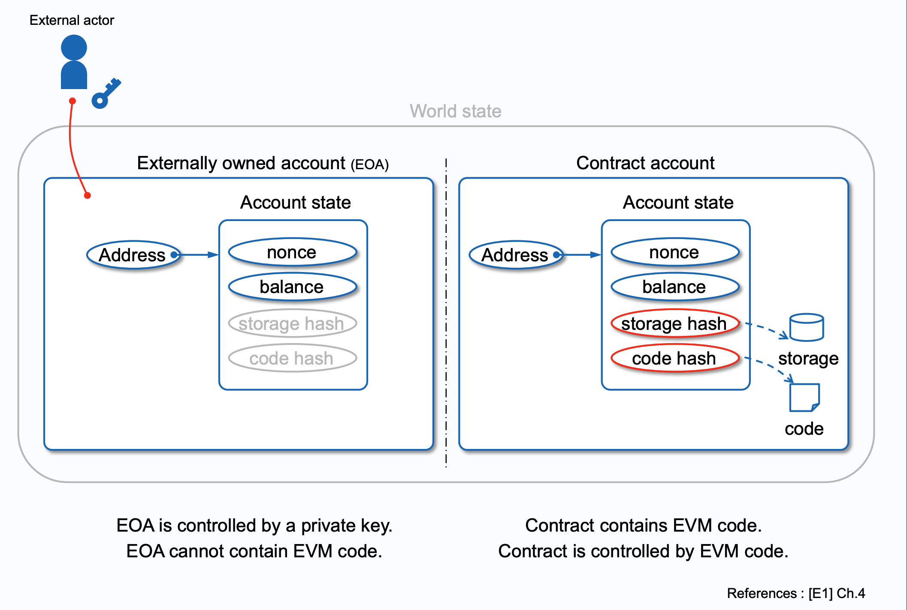

# Intro : Why EIP-7702
이더리움 지갑은 ‘0x’로 시작하는 40자리 16진수 문자열, 즉 주소(address)로 식별된다. 이러한 주소 형태를 갖춘 값이라면 코인과 토큰을 보관할 수 있는 지갑이 될 수 있으며, 이더리움에서는 크게 두 가지 방식의 지갑 계정을 정의한다.

- **외부 소유 계정(EOA: Externally Owned Account)**: 개인키(private key)로부터 파생된 공개키 주소
- **컨트랙트 계정(CA: Contract Account)**: 스마트 컨트랙트에 할당된 주소

**EOA**는 고유한 단일 비밀키를 통해 파생되며, 이 키를 소유하고 있는 사람이 지갑의 자산을 관리하는 주인이 된다. 그러나 이러한 구조는 개인키 관리가 매우 불편하며 블록체인 사용자에게 불편한 UX를 야기시킨다. 개인키 하나만 노출되어도 지갑 내 모든 자산이 탈취될 수 있는 보안 위험이 있다. 특히 개인키는 64자의 16진수 문자열로 이루어져 있어 은행 비밀번호처럼 외우기 어려우며, USB 등 이동식 매체에 저장해 다닐 경우 오히려 보안이 취약해진다.</br>
반면 **CA**는 지갑에 필요한 기능(전송, 잔액조회, 소유권 검사.. 등등 )이 구현된 스마트컨트랙트를 의미한다. EOA가 가지는 보안 한계를 스마트 컨트랙트 수준에서 다양한 인증 절차로 구현하여 보완할 수 있다. 예를 들어 멀티 시그(Multi-Sig) 지갑, ERC-4337 기반 Smart Wallet, MPC(Multi-Party Computation)를 활용한 계정 복구 및 상속 기능 등이 대표적이다.</br>
하지만, 개인키에서 지갑 주소가 파생되는 EOA와 다르게 **CA의 지갑 주소는** 랜덤으로 생성되기 때문에 자체 서명을 할 수 없다. 스마트 컨트랙트는 누구나 호출할 수 있으므로, 호출 주체가 소유자인지를 확인하기 위해 EOA와 마찬가지로 개인키로 생성된 디지털 서명을 받아 검증해야 한다. **결국 CA를 호출하기 위해서는 EOA의 개인키가 필요한 구조이다보니, 여전히 불편한 개인키의 관리가 필요하다.**</br>

**이러한 아이러니한 상황을 해소하기 위해 EIP-7702는 EOA와 CA의 경계를 허물어, EOA를 CA처럼 사용할 수 있도록 만들어 사용자 경험을 크게 개선하는 것을 목표로 한다.**

<br/>

# Account Architecture
<div align="center">

<!--  -->

<span>[출처] https://takenobu-hs.github.io/downloads/ethereum_evm_illustrated.pdf#20</span>

</div>

이더리움 계정은 EOA와 CA은 모두 위 이미지와 같이 네 가지 필드 nonce, balance, storage hash, code hash 를 가진다. 이때 스마트 컨트랙트의 코드는 code hash에 저장된다. 계정이 트랜잭션에 의해 호출되면, EVM은 code hash에 기록된 컨트랙트 코드를 불러와 실행한다. 실행 중 생성·수정된 데이터는 [MPT(Merkle Patricia Trie) 구조](https://ethereum.org/en/developers/docs/data-structures-and-encoding/patricia-merkle-trie/)로 storage에 저장되고, 최종 머클 루트 해시가 storage hash에 기록된다. 반면 EOA는 code hash와 storage hash 필드가 비어 있다. 그러나 **EIP-7702를 적용하면 EOA의 code hash 영역에 데이터를 삽입하여, EOA가 마치 CA처럼 동작하도록 확장할 수 있다.**

<br/>

# Set EOA account code for one transaction
지금까지 EIP-7702의 역할을 살펴보았지만, EIP-7702는 EIP-2718에 따라 추가된 새로운 트랜잭션 유형이다. EIP-7702는 type 4 트랜잭션으로 지정되며, 이를 통해 사용자는 특정 EOA의 code hash 필드에 데이터를 저장할 수 있다. 이때 code hash에는 `‘Delegation Indicator(이하 DI)’`라는 데이터가 저장된다. DI는 EOA가 스마트 컨트랙트처럼 동작하도록 계정의 코드를 특정 스마트 컨트랙트에 위임한 상태를 나타내는 특수 플래그다. DI가 설정된 EOA가 호출되면, EVM은 해당 Indicator에 명시된 컨트랙트 주소의 code hash에 저장된 코드를 불러와 실행한다. EIP-7702는 이러한 방식을 통해 EOA를 CA처럼 사용할 수 있게 만든다.

### Delegation Indicator (DI)
```
0xef0100 || contract_address
```

Delegation Indicator는 `0xef0100` + 위임된 스마트 컨트랙트 주소(contract_address)를 결합하여 총 23 바이트로 구성된다. 여기서 접두사 `0xef`는 [EIP-3541](https://eips.ethereum.org/EIPS/eip-3541)에서 금지된 opcode로 지정된 값이므로, 일반적인 EVM 코드에서는 결코 등장하지 않으며, 설령 EVM이 해당 값을 실행한다면 트랜잭션은 무조건 실패처리된다. 따라서 이 값은 **안전한 마커(marker)** 로 활용할 수 있다.

```

```

EIP-7702 등장 이후로, 해당 마커는 EVM 내 `CALL`·`DELEGATECALL`·`STATICCALL` 등의 호출 연산 시, 첫 바이트인 `0xEF`를 인식하면 ***“코드를 바로 실행하지 말고, 뒤따르는 20바이트 주소의 코드를 대신 불러와 실행하라”*** 는 특수 로직을 안전하게 적용하도록 전용 마커 역할을 수행한다.
